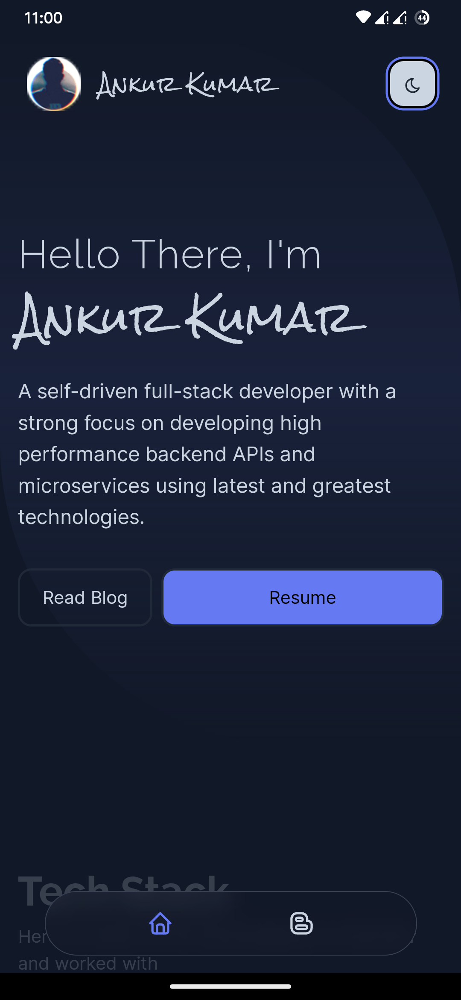

# Personal Website

Welcome to my personal development website!
This site is a hub for showcasing my work, sharing my thoughts on technology,
and connecting with like-minded individuals.

## Table of Contents

1. [About](#about)
2. [Features](#features)
3. [TechStack](#techstack)
4. [Screenhosts](#screenhosts)
5. [Contact](#contact)

## About

This website is a personal project aimed at highlighting my journey as a developer.
It includes detailed information about my background, skills, and experiences,
as well as a collection of my projects and blog posts.

## Features

- **Home Page:** Provides an introduction and a brief overview of the website.
- **Blog:** Features articles on various topics related to development, including tutorials, insights, and personal reflections.
- **Contact:** Includes a contact links to my social media profiles, making it easy to get in touch with me.
- **Tags:** Provides a list of tags used in the blog posts.
- **Categories:** Provides a list of categories used in the blog posts
- **Search:** Provides a search bar for the blog posts.
- **View Transitions:** Provides a smooth transition between pages.
- **Progressive Web App:** Provides a PWA for the website.
- **Dark Mode:** Provides a dark mode toggle for the website.
- **Notion Like Banner:** Provides a banner for Notion-like features.
- **Table of Contents:** Provides a table of contents for the blog posts.
- **RSS Feed:** Provides an RSS feed for the blog posts.
- **Sitemap:** Provides a sitemap for the website.
- **SEO:** Provides search engine optimization (SEO) for the website.
- **Analytics:** Provides analytics for the website.
- **Views Counter:** Tracks the number of views for the blog posts.
- **Comments:** Provides comments/discussions section for the blog posts.
- **Read Time:** Calculates the reading time for the blog posts.

## TechStack

- **Astro:** Astro framework for building static websites.
- **Tailwind CSS:** CSS framework for building responsive websites.
- **Daisy UI:** UI components library for building websites.
- **PageFind:** Search engine for blog posts.
- **Svelte:** For Reactive Componennts
- **Qwik:** For Reactive Componennts
- **Vercel:** For hosting
- **Neovim:** Using Neovim As Code Editor / Writing Markdown
- **Obsidian:** Using Obsidian As CMS
- **FrontMatterCMS:** Front Matter Headless CMS right in your code editor

## Screenhosts

### Writing Markdown in Obsidian

### Write Markdown in Neovim

### Neovim Editor

### FrontMatterCMS, For those who prefer vscode

### Website Homepage

### Technologies Section

### Recent Updates Section

### Blog Page

### Article Page

### Sticky Table Of Content

### Pagefind Search

### RSS FEED

### Mobile Views

<table>
  <tr>
    <td></td>
    <td></td>
    <td></td>
  </tr>
  <tr>
    <td></td>
    <td></td>
    <td></td>
  </tr>
</table>

## Contact

If you would like to connect with me, feel free to reach out via email at [contact@ankur-kumar.in](mailto:your-email@example.com) or connect with me on [LinkedIn](https://www.linkedin.com/in/5321ankur).

---

#### NOTE: This website is very new and still in development.

If you have any suggestions or feedback, please don't hesitate to reach out.
I am always open to new ideas and contributions.
